# Vienna Game AI Library

Vienna Game AI Library is a single-header C++ library that encompasses popular AI algorithms to be used in the development of 2D real-time strategy games with a focus on non-player character management.

The library was created due to the lack of toolkits written in the C++ programming language that contain all algorithms required to develop RTS games. It started as a Master thesis by Lavinia-Elena Lehaci under the supervision of Univ.-Prof. Dipl.-Ing. Dr. Helmut Hlavacs. This project is intended to be worked on during future theses and it will be expanded by other algorithms.

From pathfinding to state machines, decision trees, and steering algorithms, Vienna Game AI Library should encompass everything a game developer might require when developing a 2D RTS game. In order to show the applicability of the library, each implemented feature is showcased in a separate example created with the help of the [raylib](https://github.com/raysan5/raylib) library.

# Project structure
- *assets* - Resource folder containing the media files used for the ```README``` file.
- *docs* - Code documentation.
- *Demo*
	- [raylib](https://github.com/raysan5/raylib)
	- *src* - Source folder containing the code for the demos.
	- *res* - Resource folder containing assets used in demos.
	- *testing* - Test folder containing the code used to measure feature execution time.
	- ```CMakeLists.txt``` - CMake file that controls which demo is executed.
- *include* - ```ViennaGameAILibrary.hpp```
- ```build_demo_win.bat``` - Script to build the project on Windows.
- ```run_demo_win.bat``` - Script to run the project on Windows.
- ```CMakeLists.txt``` - CMake file to build the entire project.
- ```README.md```

# Setup - Windows
## Prerequisites
- [Doxygen](https://www.doxygen.nl/index.html)
- [Ninja](https://ninja-build.org/)
- [MSYS2](https://www.msys2.org/) - CMake and Clang need to be installed through it.
	- After it is installed, run ```pacman -Syu``` from the *MSYS2* terminal to update the package database.
	- Open the *MINGW64* terminal from the *msys64* folder and run the following command:
		- ```pacman -S mingw-w64-x86_64-clang mingw-w64-x86_64-cmake```
	- Check: CMake minimum version required: 3.28.0.

- Add the following folders to the PATH environment variable:
	- *msys64/mingw64/bin*
	- *doxygen/bin*
	- *ninja*

## Build and run the project
1. Clone the project.
2. Run ```git submodule init``` and ```git submodule update``` to fetch raylib.
3. Run ```build_demo_win.bat``` to build the project. The output will be stored in the build folder. 
	- The ```-DCMAKE_BUILD_TYPE``` flag enables the build type. Currently set to ```Release```, but it can also be changed to ```Debug```.

Make sure Clang and Ninja are used by this project. The first time you build the process, once the process starts, the first two lines should be the following:
```
-- Building for: Ninja
-- The CXX compiler identification is Clang ...
```
4. Run ```run_demo_win.bat``` to start the project.

## To run different demos
In *Demo/```CMakeLists.txt```*, uncomment the path of the .cpp file that you want to run.
```
add_executable(Demo src/demo_Pathfinding.cpp ${PROJECT_SOURCE_DIR}/include/ViennaGameAILibrary.hpp)
```
In the line above, the pathfinding example is used as the running demo.
# Code documentation
Documentation is generated using Doxygen. To see it, open ```index.html``` which can be found in the *docs/html* folder.

# How to use each feature the library provides
> **Note** : When using the navigation mesh and its features, keep in mind that you will need to transform the library coordinates into screen coordinates. The pathfinding demo contain examples of how to do this.

## 1. **Data structures and data types**

*Vienna Game AI Library* uses two custom made vectors: ```Vec2ui``` and ```Vec2f```. Both represent 2D vectors, with ```Vec2ui``` made of unsigned integers, and ```Vec2f``` of floats.
The navigation mesh uses ```Vec2ui```, while Boids use ```Vec2f``` due to required mathematical operations. Other data structures used in the library are ```std::vector``` and ```std::unordered_map```.

The data types used in the library are: ```uint32_t```, ```int32_t``` and ```float```. Each has a typedef declaration to make the code more readable (```uint32_t``` -> ```ui32```,  ```int32_t``` -> ```i32```, ```float``` -> ```f32```). Booleans and strings are also used, especially in the demo examples.

There are custom structs also defined in the library. The ```NavMesh``` class is represented by a ```std::vector``` of ```NodeData``` objects. If geometric preprocessing is used for pathfinding, the ```Region``` struct is also used to store the nodes assigned to each region, and  ```RegionList``` to manage all regions.

## 2. **Path finding**

> Demo example: *Demo/src/demo_Pathfinding.cpp*

- Create a navigation mesh

To generate it randomly, pass the desired width and height, as well as a percentage which will limit the amount of obstacles spawned within the navigation mesh. To load it from a file, simply call the constructor with the file path as the argument.
```
	// Generate it randomly
	VGAIL::NavMesh* navmesh = new VGAIL::NavMesh(navmeshWidth, navmeshHeight, 30.0f);

	// Or load it from a file
	VGAIL::NavMesh* navmesh = new VGAIL::NavMesh("Demo/res/navmesh.txt");
```
The navmesh file can be created either manually or by the game itself. The file has the following structure:
```
	navmeshWidth
	navmeshHeight
	owwwwoowwowww...
```
Both ```navmeshWidth``` and ```navmeshHeight``` need to be positive integers. The third line describes the pattern of the navigation mesh, where ```w``` is a walkable area and ```o``` is an obstacle. Make sure that the number of characters are equal to ```navmeshWidth``` * ```navmeshHeight```.

There is also the option to save a randomly generated navmesh. This can be done by calling ```saveToFile(const std::string& filepath)``` (see lines 808-821) and by passing a file path. If the file doesn't exist, it will be created automatically.

- Create start and end positions for the A* algorithm

The start and end positions need to be ```Vec2ui``` instances. Inside the application, they can be converted to screen coordinates by multiplying to a number of your choice. *See the demo for pathfinding for more details, specifically calculations that use ```gridStride```*.
``` 
	VGAIL::Vec2ui startPosition = VGAIL::Vec2ui(1, 1);
	VGAIL::Vec2ui endPosition = VGAIL::Vec2ui(15, 15);
```
- Optional: start geometric preprocessing
 
While A* ensures finding the shortest path, it sometimes can be quite slow. In video games, it is preferred that the path is retrieved as fast as possible, even if that means that the path returned is not the shortest one, as it will most likely not have a big impact on the game performance. A path that is found fast but is not necessarily the shortest from all options is called an optimal path. Geometric preprocessing ensures finding an optimal path, thus not necessarily the shortest one.

This process can be called while setting up the application (before the game loop starts) in order to perform all calculations before the application starts. It can be done in two ways: with single or multiple threads. The call for this process is as follows:
```
	void preprocess(bool multithreading = false, ui32 numThreads = 4)
```
The boolean specifies whether to use multithreading (by default it is set to false), and ```numThreads``` is the number of threads needed to run in parallel (by default, it is set to 4).

This process will work on the Regions defined when the NavMesh is created (see lines 916-939). The number of regions depends on the NavMesh size, and by default they are set to each contain 5 x 5 nodes (5 on the *x* axis, 5 on the *y* axis). Depending on the NavMesh size, this can be changed accordingly to maximize performance. If multithreading is used, each thread receives ```totalNumberOfRegions / numThreads``` regions.

The following picture shows how the regions would look like on top of the demo for pathfinding by having region sizes of 9x9. Each orange square represents a region.

<div align="center">
	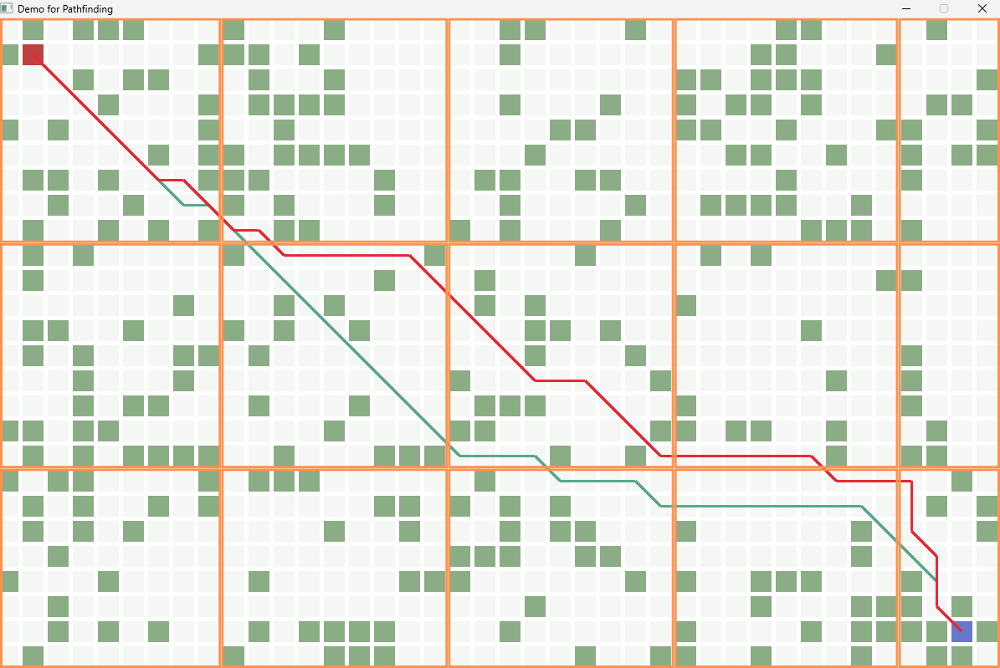
</div>

During this process, the A* algorithm (```AStar()```) is called to calculate the distance between each node and each region. Therefore, at the end of the process, the ```m_adjList``` from the ```NavMesh``` class will contain the shortest path from one node to a region at position ```m_adjList[nodeIndex][regionID]```. 

- Find the most optimal path

```
	// Without geometric preprocessing
	std::vector<VGAIL::Vec2ui> path = navmesh->findPath(startPosition, endPosition);

	// Using geometric preprocessing with/without multithreading
	std::vector<VGAIL::Vec2ui> path = navmesh->findPreprocessedPath(startPosition, endPosition);
```

The ```findPath()``` method calculates the path by using A*, while ```findPreprocessedPath()``` retrieves the stored path if geometric preprocessing has been performed.

If the second call is invoked, the function will first identify the region to which the target node was assigned. It then looks for the precomputed path from the start node to the target region. If found, it will perform the A* algorithm to get the path from the end node of the precalculated path to the target node.

## 3. **Decision trees**

> Demo example: *Demo/src/demo_DecisionTree.cpp*

- Create the decision tree.

```
	VGAIL::DecisionTree tree;
```

- For each node of the tree (and recursively its children) a custom class needs to be implemented to delegate actions to its children based on some criteria.

Each decision node needs to implement its own ```makeDecision(float dt)``` method, in which it either delegates further actions to its children or implements game logic. In the example below, the ```IsEnemyClose``` class is responsible for checking the distance between the player and an enemy. Depending on this distance, it calls a child decision node. 
```
	// Example: a character makes decisions based on the distance to an enemy
	class IsEnemyClose : public VGAIL::DecisionNode
	{
	public:
		IsEnemyClose(VGAIL::Vec2f& enemyPos)
			: enemyPos(enemyPos) {}

		~IsEnemyClose() {}

		void makeDecision(float dt) override
		{
			float dist = VGAIL::distance(position, enemyPos);
			if (dist <= 100.0f)
			{
				getChild(0).makeDecision(dt);
			}
			else if (dist > 100.0f && dist < 150.0f)
			{
				getChild(1).makeDecision(dt);
			}
			else
			{
				getChild(2).makeDecision(dt);
			}
		}

		VGAIL::Vec2f position;
		VGAIL::Vec2f& enemyPos;
	};
```
- Create the root of the tree.

```
	// Example for the code shown above
	VGAIL::DecisionNode& root = tree.createRoot<IsEnemyClose>(...args);
```

→ ```...args``` refers to any arguments that need to be passed to the custom class. In the example above for the ```IsEnemyClose``` class, a ```VGAIL::Vec2f&``` variable is required.

- Add nodes and their children

```
	VGAIL::DecisionNode& node1 = root.addChild<Class1>(...args);
	VGAIL::DecisionNode& node2 = root.addChild<Class2>(...args);
	VGAIL::DecisionNode& node3 = root.addChild<Class3>(...args);
	...
	VGAIL::DecisionNode& node1_child1 = node1.addChild<ClassX>(...args);
	...
```

The order in which the child nodes are instantiated is important, as it will matter when calling it from the parent node. In the example above, in the ```isEnemyClose``` class, ```getChild(0)``` will call the first child node that was created, in this case ```node1```.

- In the game loop, update the decision tree

```
	tree.update(deltaTime);
```

In the example from *demo_DecisionTree.cpp*, both characters have their own decision tree and each chosen decision is displayed every frame on the screen.

<div align="center">
	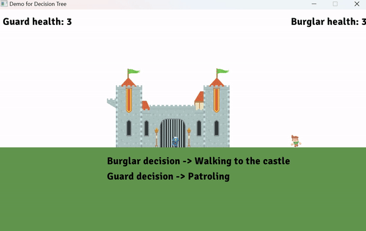
</div>

The logic behind the decision trees is displayed in the following picture.

<div align="center">
	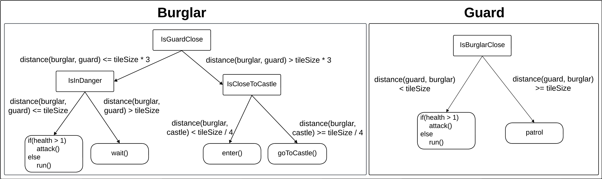
</div>

In this example, the decision nodes are represented by the rectangular objects (*IsGuardClose*, *IsBurglarClose*, etc.).

## 4. **State machines**

> Demo example: *Demo/src/demo_StateMachine.cpp*

<div align="center">
	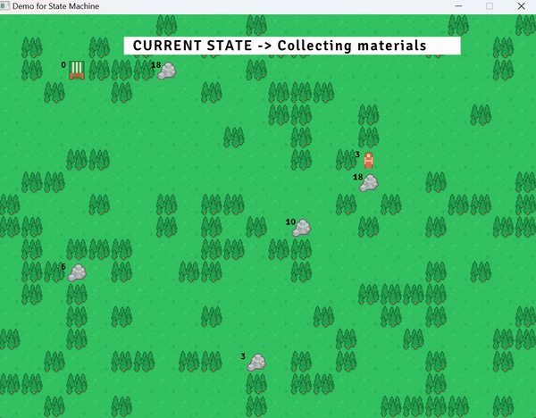
</div>

- Create a state machine.

```
	VGAIL::StateMachine stateMachine;
```

- Create states.

```
	VGAIL::State* walking = stateMachine.createState();
	VGAIL::State* sleeping = stateMachine.createState();
```

- Implement the state in the update callback.

The ```onUpdateCallback()``` method is called every frame, so the game logic for the state should be implemented in this method.
```
	walking->onUpdateCallback = [&](float deltaTime) {
		// walk, play walking animation...
	};
```
- If needed, add actions at the start and/or end of a state.

Each state has ```onEnterCallback()``` and ```onExitCallback()``` methods. ```onEnterCallback()``` is called once the state is activated, and ```onExitCallback()``` is called at the end when the state is exited. 
```
	sleeping->onEnterCallback = [&]() {
		// play falling asleep animation
	};
```
- Create transitions between states.

Transitions are responsible with changing the current active state by checking a certain condition. If the condition is met, the ```onEnterCallback()``` of the next state is called. If ```onEnterCallback()``` is not implemented, it will call ```onUpdateCallback()``` immediately.
```
	walking->addTransition(sleeping, [&]() {
		return health <= 2;
	});
```
In the example above, the transition is responsible with choosing the correct state based on the character's health. Once the health is less than or equal to 2, it will trigger the ```onExitCallback()``` of the "walking" state (if available), then the ```onEnterCallback()``` / ```onUpdateCallback()``` method of the "sleeping" state.

- In the game loop, update the state machine.

```
	stateMachine.update(deltaTime);
```

This method is responsible with managing the states and transitions between them every frame.

## 5. **Steering behaviors**

Demo examples:
	
>*Demo/src/demo_SteeringBehaviors.cpp* (all steering behaviors combined)

>*Demo/src/SteeringBehaviors* (each individual steering behavior with its own demo)

The steering behaviors can only be used on instances of the ```VGAIL::Boids``` class.

- Create the boid.

Each boid needs a position, a velocity, and a maximum speed when instantiated. By default, the maximum speed is 5.0f, and the position and velocity are both 0. Each boid also has an id, used in the flocking algorithm, but since it is not relevant for the rest of the steering behaviors, it is set to 0 by default.

```
	VGAIL::Boid* agent = new VGAIL::Boid(position, velocity, maxSpeed);
```
- Calculate the steering force
	### 5.1. **Seek**
	> Demo example: *Demo/src/SteeringBehaviors/demo_SeekAndFlee.cpp*

	The "seek" steering behavior allows for a realistic movement towards a given target. The method takes as arguments ```targetPosition``` (```Vec2f``` - position of the target) and ```maxAcceleration``` (```float``` - the maximum rate at which the velocity can change per unit of time).

	```
	VGAIL::Vec2f steeringForce = agent->seek(targetPosition, maxAcceleration);
	```

	<div align="center">
		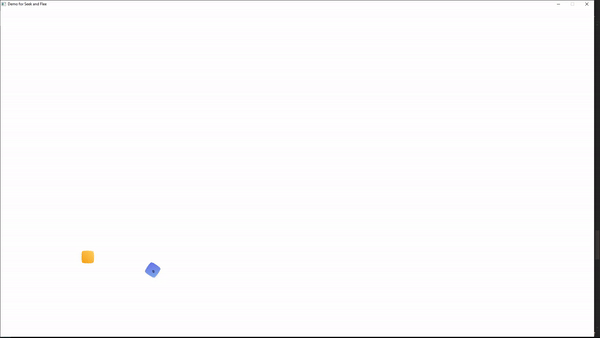
	</div>

	In the example above, the blue object is seeking the player (yellow object).

	### 5.2. **Flee**
	> Demo example: *Demo/src/SteeringBehaviors/demo_SeekAndFlee.cpp*

	The "flee" steering behavior is the opposite of "seek", as it moves away from and not towards a target. The arguments are the same as for the "seek" behavior.

	```
	VGAIL::Vec2f steeringForce = agent->flee(targetPosition, maxAcceleration);
	```
	
	<div align="center">
		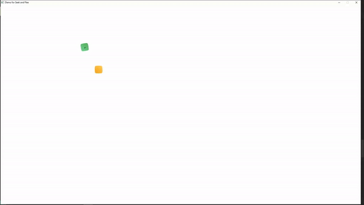
	</div>

	In the example above, the green object is fleeing the player (yellow object), while also staying inside the borders of the window.

	### 5.3. **Arrive**
	> Demo example: *Demo/src/SteeringBehaviors/demo_Arrive.cpp*

	The "arrive" steering behavior is responsible for slowing down the character before it reaches its destination such that it can stop smoothly. If the character is far from the destination, it uses the "seek" behavior to move towards it, and once it gets close enough, it starts slowing down until it eventually reaches the target. 

	In the library, it takes three arguments: ```targetPosition``` (```Vec2f``` - destination), ```slowRadius``` (```float``` - the radius of the slowing area), and ```maxAcceleration``` (```float``` - the maximum rate at which the velocity can change per unit of time).

	```
	VGAIL::Vec2f steeringForce = agent->arrive(targetPosition, slowRadius, maxAcceleration);
	```

	<div align="center">
		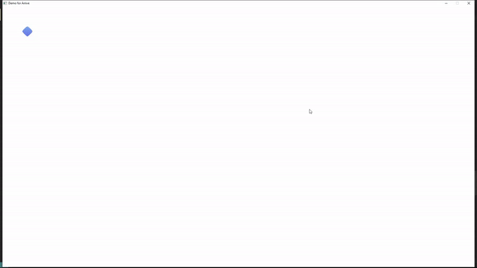
	</div>

	In this example, the blue object uses the "arrive" steering behavior to get to the green dot and it slows down once it enters the area shown by the red circle.
	
	This behavior is useful in cases when it is important to show that a character reached its target destination. The "seek" behavior, used alone, will make the character bounce back and forth around the target, but the "arrive" behavior will ensure that the character will not move through the target by slowing down so it can stop once it reaches it.

	### 5.4. **Pursue**
	> Demo example: *Demo/src/SteeringBehaviors/demo_PursueAndEvade.cpp*

	"Pursue" is very similar to the "seek" behavior in the sense that it follows a given target. The difference is that the pursuer tries to "catch" the target by anticipating its movement, which is done by predicting the target's future positions. That is done such that it avoids taking unnecessary paths as it will estimate where the target will be within the next few seconds and move towards that new position.

	The method takes three arguments: ```targetBoid``` (```Boid``` - the target to pursue), ```maxAcceleration``` (```float``` - the maximum rate at which the velocity can change per unit of time), and ```maxPrediction``` (```float``` - the maximum prediction time used to estimate where the target will be in the future).

	```
	VGAIL::Vec2f steeringForce = agent->pursue(targetBoid, maxAcceleration, maxPrediction);
	```

	<div align="center">
		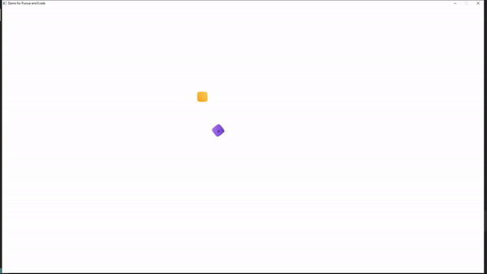
	</div>

	In this example, the purple object is following the player (yellow object).

	### 5.5. **Evade**
	> Demo example: *Demo/src/SteeringBehaviors/demo_PursueAndEvade.cpp*

	"Evade" is the opposite of "pursue", as it uses prediction to "escape" a given target. The same arguments as for the "pursue" behavior are used.

	```
	VGAIL::Vec2f steeringForce = agent->evade(targetBoid, maxAcceleration, maxPrediction);
	```

	<div align="center">
		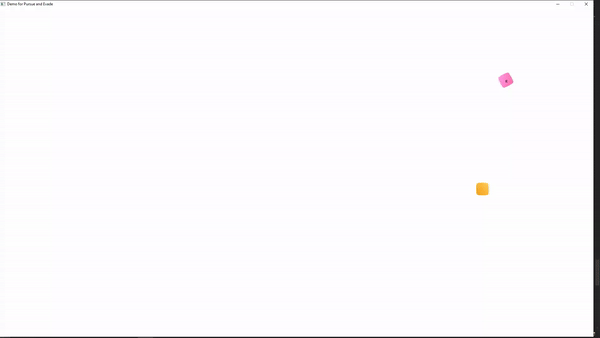
	</div>

	In this example, the pink object is following the player (yellow object), while also staying inside the borders of the window.

	### 5.6. **Wander**
	> Demo example: *Demo/src/SteeringBehaviors/demo_Wander.cpp*
	
	The "wander" steering behavior produces a natural-looking movement of a character "casually" walking around. Its implementation, following Craig Reynold's proposal, uses a circle defined in front of the character from which the steering force is calculated.

	<div align="center">
		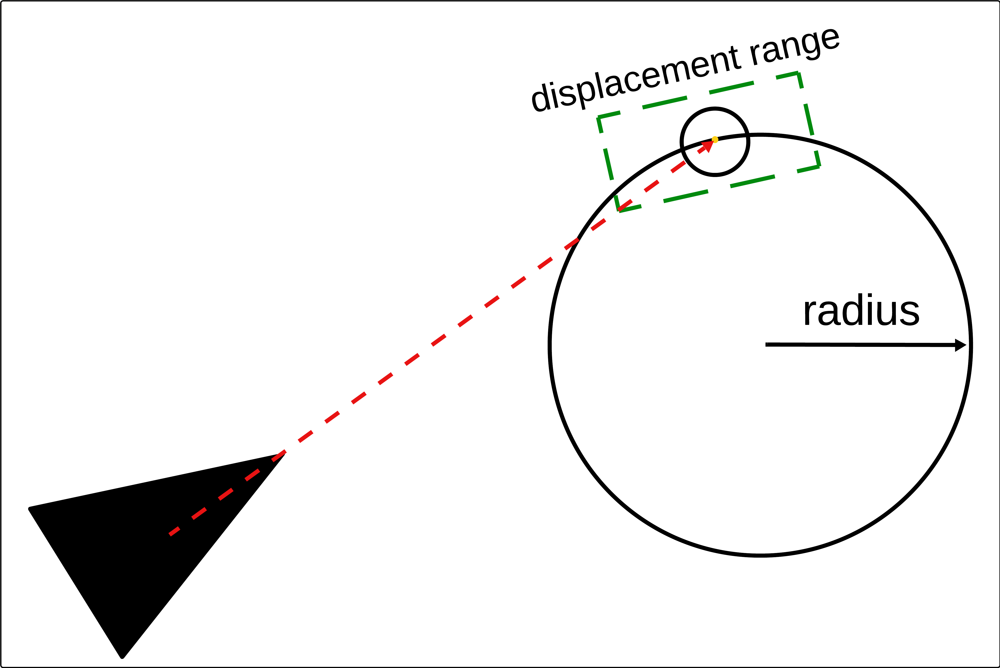
	</div>
	
	In the picture above, the character is represented by the triangle. The circle defined in this behavior is set at a ```circleDistance``` from the character and has a ```circleRadius```. Every frame, a random point is chosen from the outline of the circle which will be the new direction the character will need to steer towards. In order to avoid strong flickering (the character moving abruptly left and right), a ```displacementRange``` is given which will be responsible for limiting the interval from which this random point is chosen. As for the previous steering behaviors, ```maxAcceleration``` is the maximum rate at which the velocity can change per unit of time.

	```
	VGAIL::Vec2f steeringForce = agent->wander(circleDistance, circleRadius, displacementRange, maxAcceleration);
	```

	<div align="center">
		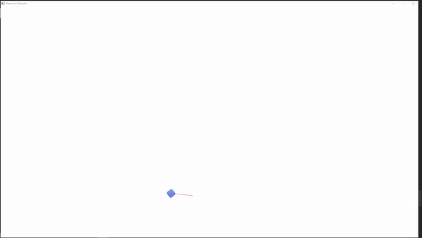
	</div>
	
	In this example, the red line is the character's velocity which changes every frame depending on the randomly chosen point.

	### 5.7. **Face**
	The ```getRotationInDegrees()``` method from the ```Boid``` class calculates the rotation of the boid in degrees and can be used to show in which direction the boid is moving.  Each texture needs a texture rotation as per the ```DrawTexturePro``` method from *raylib*. In the demos for the steering behaviors, the ```getRotationInDegrees()``` method is simply called when drawing the texture on the screen such that the texture is always facing the direction it is moving.

The library also provides implementation for the three steering behaviors used usually in flocking ("separation", "alignment", "cohesion"). They are detailed in the next section.
- Apply the steering force and update the position. 

```
	agent->applySteeringForce(steeringForce);
	agent->updatePosition(deltaTime);
```

→ ```steeringForce``` is the output vector resulted from any of the methods shown above. 

Please note that the ```updatePosition()``` method must be called after applying the steering force, otherwise the boid's position will not change according to the new calculations.

There is also a demo that uses all the steering behaviours covered in this section and it can be found in the *Demo/src/demo_SteeringBehaviors.cpp* file. A snippet of this example is given in the following gif.

<div align="center">
	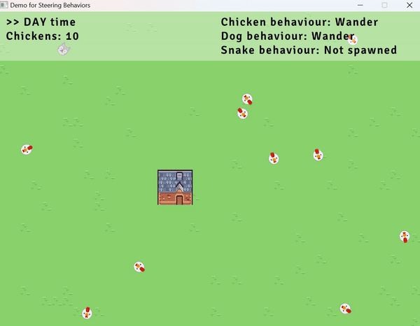
</div>

## 6. **Flocking**

The flocking behavior only works on ```VGAIL::Boid``` instances. The implementation follows Craig Reynolds's proposal.

- Create the flock.

This is responsible for managing all boids such that they respect the three steering behaviors: "separation", "alignment", and "cohesion".

```
	VGAIL::Flock* flock = new VGAIL::Flock();
```

"Separation" ensures that the boids do not overlap, thus steers the boids away from one another to avoid crowding. "Alignment" is responsible for calculating the average velocity of the boids and steer them accordingly. "Cohesion" is steering the boids towards the average position of the boids from the same group.

- Set the separation and perception ranges.

```
	flock->setRanges(separationRange, perceptionRange);
```

→ ```separationRange``` is used in the "separation" behavior. Each boid needs such a range to avoid colliding with other boids. The algorithm checks for each boid if any fellow boid is at a distance smaller than this range, in which case it will steer the boid away such that it creates space between them.

→ ```perceptionRange``` is used in both "alignment" and "cohesion". This range represents the distance within which a boid considers neighboring boids, or in simpler terms, how far a boid "sees" other nearby boids. Once other boids are in this range, the algorithm will use "alignment" and "cohesion" to match its velocity to the other boids' velocity and to position the boid within the group.

- Add boids to the flock.

To add a boid to the flock, simply call the following method:

```
	flock->addBoid(position, velocity, minSpeed, maxSpeed);
```

Both ```position``` and ```velocity``` are ```Vec2f```, while ```minSpeed``` and ```maxSpeed``` are ```float```.

- In the game loop, update the flock.

```
	flock->update(deltaTime, avoidFactor, matchingFactor, centeringFactor);
```

To update the flock, ```deltaTime``` is needed such that smooth movement is ensured. On top of that, three different factors are required as well.

→ ```avoidFactor```  determines how strongly boids react to possible collisions.

→ ```matchingFactor``` determines how strongly boids steer to match the average velocity of their neighbours.

→ ```centeringFactor``` determines how strongly boids steer to match the average position of their neighbours.

<div align="center">
	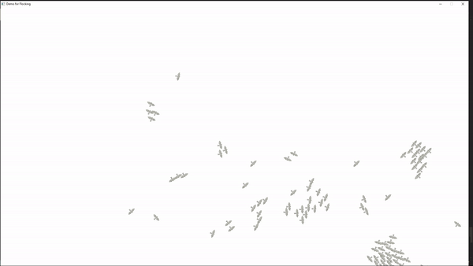
</div>

# Resources
- Textures
	- [Platformer Pack Medieval](https://kenney.nl/assets/platformer-pack-medieval)
	- [Toon Characters 1](https://kenney.nl/assets/toon-characters-1)
	- [Medieval RTS](https://kenney.nl/assets/medieval-rts)
	- [Shape Characters](https://kenney.nl/assets/shape-characters)
	- [Animal Pack Redux](https://kenney.nl/assets/animal-pack-redux)
	- [Tiny Town](https://kenney.nl/assets/tiny-town)
	- [Fish Pack](https://kenney.nl/assets/fish-pack)
- Fonts: 
	- [Signika](https://fonts.google.com/specimen/Signika/about?preview.size=57&lang=en_Latn)
- Inspiration for all features -> [Artificial Intelligence for Games, 2nd edition](https://www.oreilly.com/library/view/artificial-intelligence-for/9780123747310/)
- A* algorithm -> The pseudocode from [A* search algorithm](https://en.wikipedia.org/wiki/A*_search_algorithm)
- Steering behaviors
	- All steering behaviors -> [Craig Reynold's proposals](https://www.red3d.com/cwr/steer/)
	- "Arrive" behavior -> [Understanding Steering Behaviors: Flee and Arrival](https://code.tutsplus.com/understanding-steering-behaviors-flee-and-arrival--gamedev-1303t)
	- "Pursue" and "Evade" behaviors -> [Understanding Steering Behaviors: Pursuit and Evade](https://code.tutsplus.com/understanding-steering-behaviors-pursuit-and-evade--gamedev-2946t)
	- "Wander" behavior 
		- [5.5 Wander Steering Behavior - The Nature of Code](https://www.youtube.com/watch?v=ujsR2vcJlLk)
		- [Understanding Steering Behaviors: Wander](https://code.tutsplus.com/understanding-steering-behaviors-wander--gamedev-1624t)
	- Flocking algorithm -> [Boids algorithm - augmented for distributed consensus](https://vanhunteradams.com/Pico/Animal_Movement/Boids-algorithm.html)
	- User Interface for the flocking demo -> [raylib [text] example - input box](https://www.raylib.com/examples/text/loader.html?name=text_input_box)
- All demo videos were converted to GIF format by using [Ezgif](https://ezgif.com/video-to-gif).